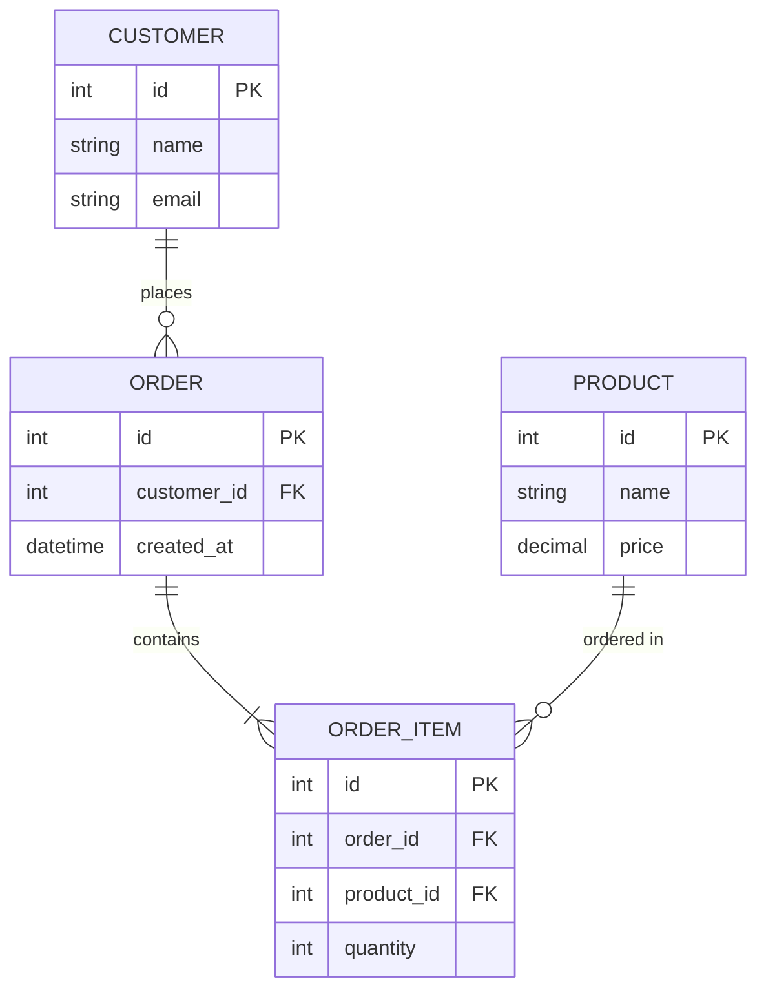
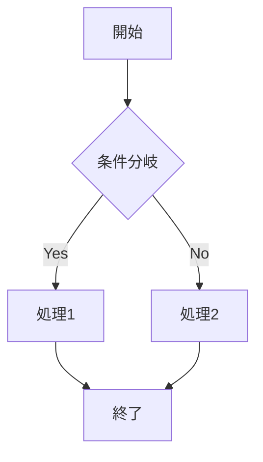

# サンプル仕様書

これは Markdown Viewer の動作確認用サンプルです。

## 概要

SDD（仕様駆動開発）で作成する仕様書のイメージ。GFM のテーブルやチェックリスト、
コードブロック、Mermaid 図が含まれます。

### 要件チェックリスト

- [x] Markdown を閲覧できる
- [x] Mermaid ER図のテーブル名をダブルクリックで選択できる
- [ ] git差分を Markdown 形式で閲覧できる

### GFM テーブル

| 機能 | 状態 | 優先度 |
| --- | --- | --- |
| Markdown閲覧 | 完了 | 高 |
| Mermaid選択 | 完了 | 高 |
| git差分 | 確認中 | 中 |

## ER図（ダブルクリックでテーブル名を選択してみてください）



## フローチャート



## コードブロック（シンタックスハイライト）

```typescript
function greet(name: string): string {
  return `Hello, ${name}!`
}
```

```python
def add(a: int, b: int) -> int:
    return a + b
```
